# PSOC&trade; 4 CAPSENSE&trade; training manual

## About this document

This training manual covers the labs for the introduction to CAPSENSE&trade; on the PSOC&trade; 4000T and the PSOC&trade; 4100T Plus training.

## Scope and purpose

The manual covers the following objectives: project creation, tuning CAPSENSE&trade; sensors, updating the PSOC&trade; 4100T Plus for optimal power consumption, and key takeaways.

## Intended audience

This manual is intended for design engineers, technicians, and developers of electronic systems.

## Table of contents

* [About this document](#about-this-document)
* [Scope and purpose](#scope-and-purpose)
* [Intended audience](#intended-audience)
* [Introduction](#introduction)
* [Required development tools and prerequisites](#_Required_development_tools)
* [CAPSENSE&trade; performance tuning](#capsensetm-performance-tuning)
* [CAPSENSE&trade; low power tuning](#capsensetm-low-power-tuning)
* [References](#references)
* [Revision history](#revision-history)
* [Disclaimer](#disclaimer)

## Introduction

This manual provides instructions to create, configure, and build the **PSOC&trade; 4100T Plus MSCLP low-power CSD button** project to optimise capacitive performance and reduce power consumption.

## <span id="_Required_development_tools"></span>Required development tools and prerequisites

### Tools

* **ModusToolbox&trade; software** v3.9 or later (Recommended installation via [ModusToolbox&trade; Setup tool](https://softwaretools.infineon.com/tools/com.ifx.tb.tool.modustoolboxsetup))
* [**Microsoft Visual Studio Code**](https://code.visualstudio.com/) with the [**ModusToolbox&trade; for VS Code**](https://marketplace.visualstudio.com/items?itemName=InfineonAG.modustoolbox-for-vscode) extension installed
* **ModusToolbox&trade; Programming Tools** v1.9.0 or later (Installed by [ModusToolbox&trade; Setup tool](https://softwaretools.infineon.com/tools/com.ifx.tb.tool.modustoolboxsetup) as a dependency to ModusToolbox&trade; v3.9)
* **ModusToolbox&trade; CAPSENSE&trade; and Multi-Sense Pack** v1.6.0 or later (Recommended installation via [ModusToolbox&trade; Setup tool](https://softwaretools.infineon.com/tools/com.ifx.tb.tool.modustoolboxsetup))
* **PSOC&trade; 4100T Plus Prototyping Kit** ([CY8CPROTO-041TP](https://www.infineon.com/evaluation-board/CY8CPROTO-041TP))

<div class="figure-images">
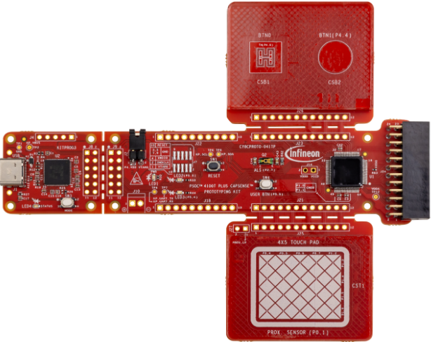
</div>

### Prerequisites

* [Introduction to PSOC&trade; 4100T Plus Training](https://infineon-academy.csod.com/ui/lms-learning-details/app/video/369c75f1-7812-405a-a312-4d1de5483f73)
* Install the software and obtain the hardware listed in the Required development tools section.


<span id="capsensetm-performance-tuning"></span>

## CAPSENSE&trade; performance tuning

### Objective

The objective of this exercise is to learn how to go through the CAPSENSE&trade; performance tuning process. The MSCLP low-power CSD button example project will have the device configured for optimal capacitive sensor tuning, but tweaks can be made to show how each setting impacts the sensitivity of the sensors.

### Description

When tuning a capacitive sensor, it is recommended to follow the CAPSENSE&trade; performance tuning process. There are five stages in this process:

- [Set the initial hardware parameters](#_Stage_1_-)

- [Set the sense clock frequency](#_Stage_2_-_1)

- [Set the Capacitive DAC (CDAC) tuning mode](#_Stage_3_-)

- [Fine-tune for the required SNR, power, and refresh rate](#_Stage_4_-_1)

- [Tune the touch threshold parameters](#_Stage_5_-)


<div class="figure-images">
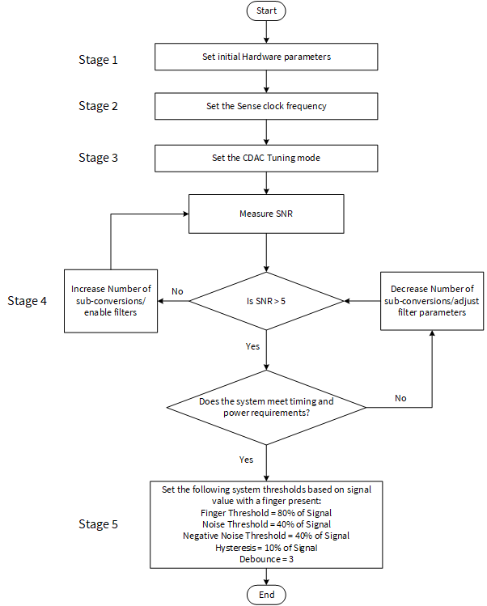
</div>

### Performance tuning steps

#### Project creation

1. Before creating the first project in this training series, create the workspace. Open **VS Code** from the **Windows Start** menu

> **Note:** If you have not installed ModusToolbox&trade; along with the ModusToolbox&trade; for VS Code extension, see the [Required development tools](#_Required_development_tools) section


2. Open a **workspace directory** for your project in VS Code

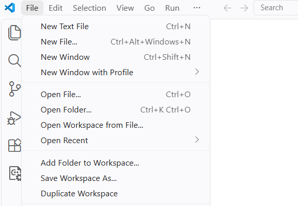


3. Click **File > Open Folder** and choose your workspace directory or create a new folder
4. Click **Select Folder** to open the workspace directory in VS Code

> **Note:** Open the workspace in trusted mode. If the default workspace trust is restricted mode, click **Restricted Mode** in the bottom left and change to trust this folder

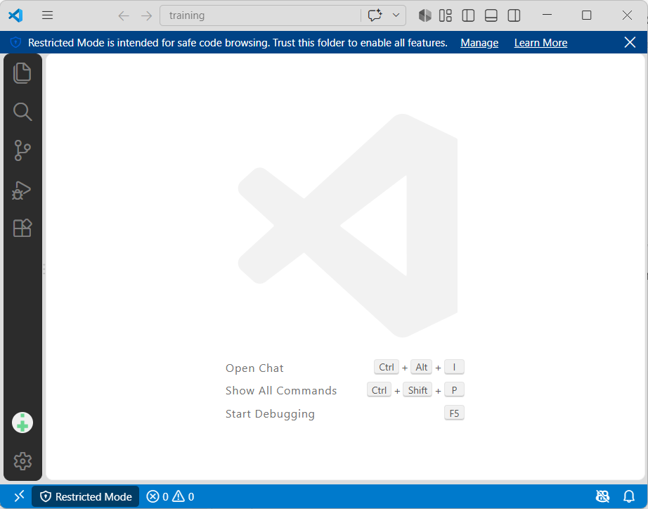


5. Open the **Command Palette** by pressing **Ctrl+Shift+P**
6. Search for **Infineon ModusToolbox&trade;: Show Main Page** and select it
7. Open the **Infineon ModusToolbox&trade; for VS Code** main page


8. Navigate to the **Create Project** tab and click **Launch Project Creation**
9. **Project Creator Tool** opens and prompts you to choose a **BSP** (Board Support Package). Select the **CY8CPROTO-041TP BSP** under the **PSOC 4 BSPs**, and continue to the application selection

BSPs are aligned with the development and evaluation kits; they provide files for basic device functionality. A BSP typically has a **design.modus** file that configures clocks and other board-specific capabilities. That file is used by the ModusToolbox&trade; configurators. A BSP also includes the required device support code for the device on the board. You can modify the configuration to suit your application

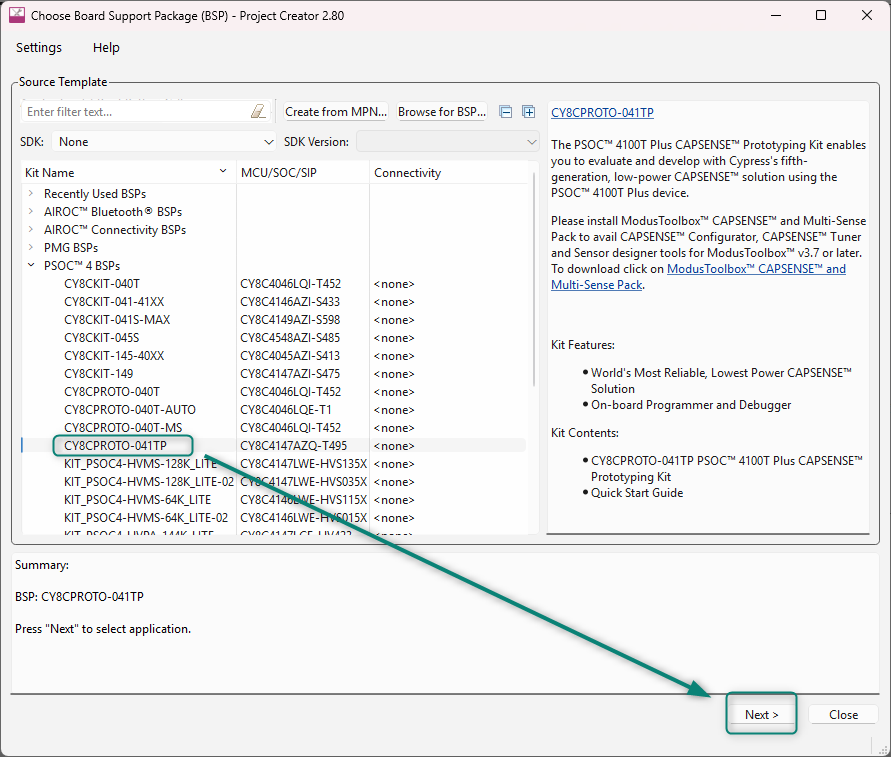

10. Select the **MSCLP Low Power CSD** button under the Sensing section, choose a project directory, and create the project

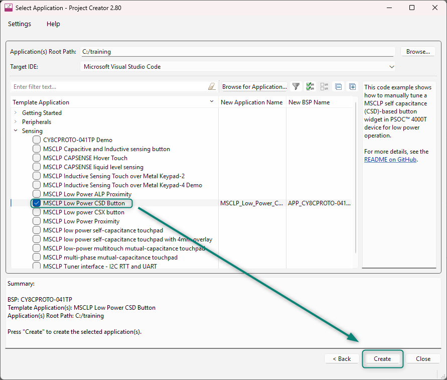

11. When project creation is complete, it will prompt you to **Load Project**. Do this so that the VS Code workspace for the new project is loaded


12. Once the workspace is loaded, the ModusToolbox application view provides actions to build, clean, erase, program, and configure the device

<div class="figure-images">
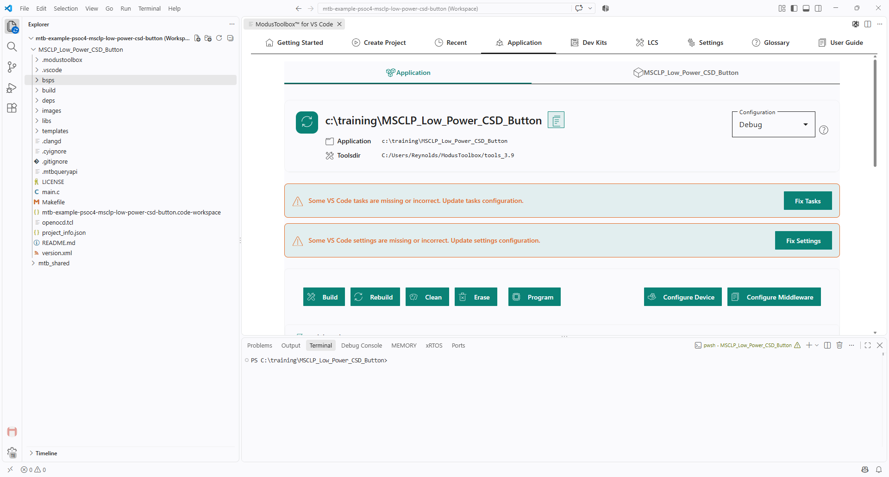
</div>

> **Note:** The ModusToolbox&trade; for VS Code extension may display buttons indicating that the VS Code tasks and settings need to be updated. Simply click the buttons to correct the issues. This is a minor version mismatch between the ModusToolbox&trade; tools and the VS Code extension and does not affect functionality.


<span id="_Stage_1_-"></span>

#### Stage 1 - set the initial hardware parameters

The initial hardware parameters include:

* CAPSENSE&trade; IMO clock frequency setting

* Modulator clock divider

* Number of initial sub-conversions

* CIC2 hardware filter

* Hardware and software IIR filter configuration

* Inactive sensor connection

* Shield configuration (mode and count)

* Raw count calibration level

* Sense clock configuration (divider and clock source)

* Number of sub-conversions

* Decimation rate

* GPIO configuration

* Sensor pins, CMOD pins, and shield pins

* Scan slots

* Initial touch and noise thresholds, debounce, and hysteresis

1. Open the **CAPSENSE&trade; Configurator** from the **ModusToolbox&trade; for VS Code** extension


<div class="figure-images">
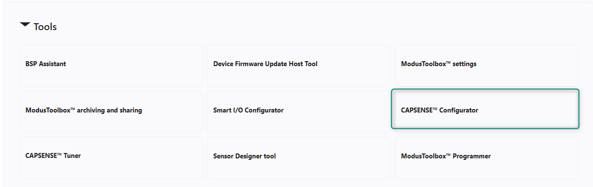
</div>

2. Open the **Advanced → General** tab to configure the initial CAPSENSE&trade; IMO clock frequency and divider, as well as the initial filter settings


<div class="figure-images">
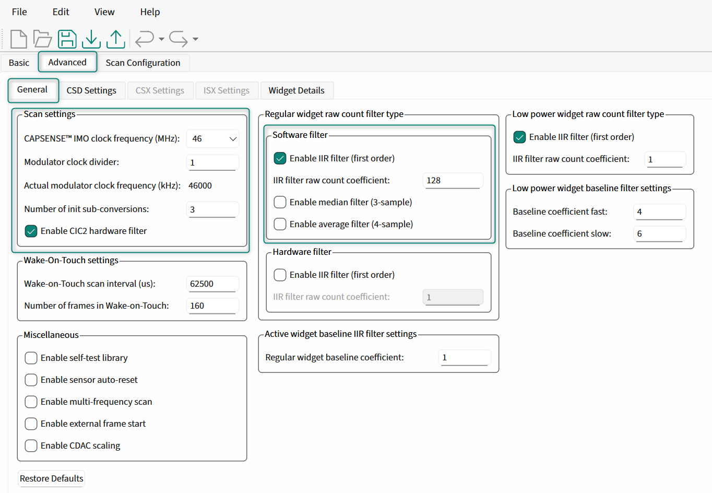
</div>

| Parameter | Setting | Comment |
| --- | --- | --- |
| CAPSENSE&trade; IMO clock frequency (MHz) | Default: Max=46 MHz | Frequency of the clock used as a source for the CAPSENSE&trade; peripheral |
| Modulator clock divider | Default: 1 | Set to obtain the optimum modulator clock frequency |
| Number of init sub-conversions | Default: 3 | To ensure proper initialization of CAPSENSE&trade; 3, an init sub-conversion is required |
| Enable CIC2 HW filter | Default: Checked | Increases Signal and SNR |
| Enable IIR filter (first order) (Software Filter) | Default: Checked | Reduces noise |
| IIR filter raw count coefficient | Default: 128 | A lower coefficient value results in lower noise, but slows down the response |
| Enable self-test library | Default: Uncheck | – |
| Enable IIR filter (first order) (Hardware Filter) | Default: Unchecked | – |

3. Open the **Advanced → CSD** settings tab to configure the initial shield settings


<div class="figure-images">
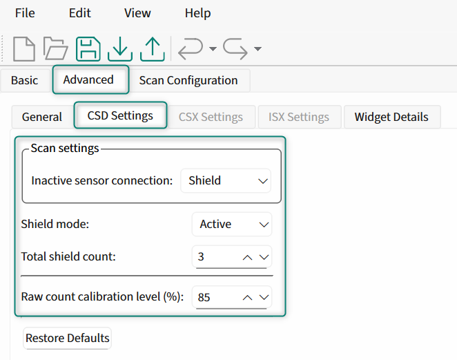
</div>

| Parameter | Setting | Comment |
| --- | --- | --- |
| Inactive sensor connection | Shield [^1] | Connecting inactive sensors to the shield reduces Cp |
| Shield mode | Active | The driven shield is a signal that replicates the sensor-switching signal. It helps reduce sensor parasitic capacitance |
| Total shield count | Equal to the number of shield electrodes in the design | Selects the number of shield electrodes used in the design. Most designs work with one dedicated shield electrode, but some designs require multiple dedicated shield electrodes to ease the PCB layout routing or to minimise the PCB area used for the shield layer |
| Raw count calibration level | Default: 70% | If the sensor raw count saturates (equals Max Raw count) on touch, reduce the Raw count calibration level (%). This will prevent raw count saturation |

[^1]: If CSX (mutual capacitance) electrodes are used, then inactive sensors should be connected to GND.

4. Open **Advanced → Widget Details** to modify each sensor widget configuration


<div class="figure-images">
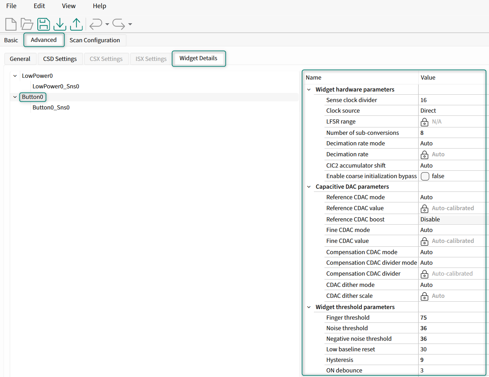
</div>

| Parameter | Setting | Comment |
| --- | --- | --- |
| Sense clock divider | Default: 16 | Value is set in [Stage 2](#_Stage_2_-_1) |
| Clock source | Default: Direct | Direct clock is a constant frequency sense clock source. When you choose this option, the sensor pin switches with a constant frequency. Spread spectrum clock (SSC) or PRS clock can be used as a clock source to deal with EMI/EMC issues. |
| Number of sub-conversions | 8 | A good starting point to ensure a fast scan time and sufficient signal. This value will be adjusted as required in [Stage 4](#_Stage_4_-_1) |
| Decimation rate | Default: Auto | Setting this to Auto will calculate the Decimation rate parameter automatically |
| Finger threshold | Default: 75 | – |
| Noise threshold | Default: 36 | Baseline is not updated when the raw count is above baseline + Noise threshold. |
| Negative noise threshold | Default: 36 | Baseline is not updated when the raw count is above baseline + Noise threshold. |
| Low-baseline reset | Default: 30 | If the raw count is lower than the Negative Noise Threshold for these many samples, the baseline is reset to the current raw count. |
| Hysteresis | Default: 9 | Prevents sensor status toggling due to system noise. |
| ON debounce | Default: 3 | Number of consecutive scans during which a sensor must be active so that a touch is reported. |

> **Note:** Widget threshold parameters will be adjusted as required in [Stage 5](#_Stage_5_-).

5. Open **Advanced → Scan Configuration** to set up the GPIO connections for the sensor, CMOD, and shield pins

6. Configure pins for the electrodes using the drop-down menu

7. Configure the scan slots using the **Auto-assign** slots option. It automatically reassigns all slots for the sensors based on a widget and sensor order

8. Select **Button0\_Sns0** as Ganged under the LowPower0 widget

9. Check the notice list for warnings or errors


<div class="figure-images">
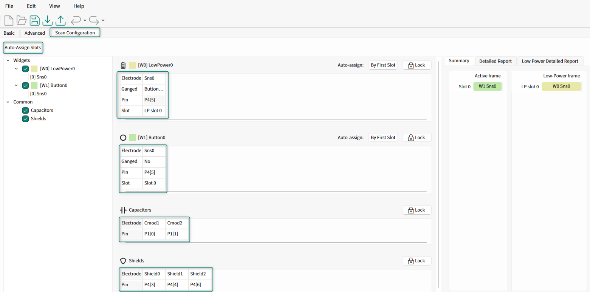
</div>

10. Click **Save** to apply the settings

11. Program the device from the **ModusToolbox&trade; for VS Code** extension


<div class="figure-images">
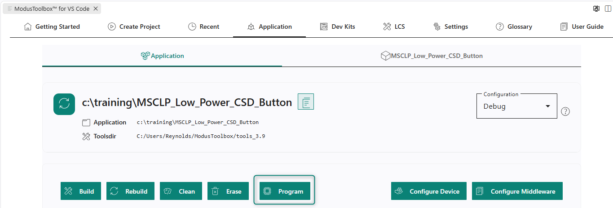
</div>

#### <span id="_Stage_2_-_1"></span>Stage 2 - set the sense clock frequency

Once all of these items are configured with initial values, program the device and begin measuring the charge and discharge cycle on the electrode so that the sense clock can be configured properly. The sense clock is derived from the modulator clock using a clock-divider and is used to scan the sensor by driving the CAPSENSE&trade; switched capacitor circuits. Both the clock source and clock divider are configurable. The sense clock divider should be configured such that the pulse width of the sense clock is long enough to allow the sensor capacitance to charge and discharge completely. This is verified by observing the charging and discharging waveforms of the sensor using an oscilloscope and an active probe. The sensors should be probed on the electrode as far away from the device as possible. If a shield is used, then the shield can be used to check that the proper charge and discharge cycle is occurring. If the shield is being probed, it should be probed as far away from the device as possible.

The sensor charges and discharges correctly when each charging phase has a pulse width of five time constants ($5\tau$), reaching 99.3% of the required voltage by the end of the phase.


<div class="figure-images">
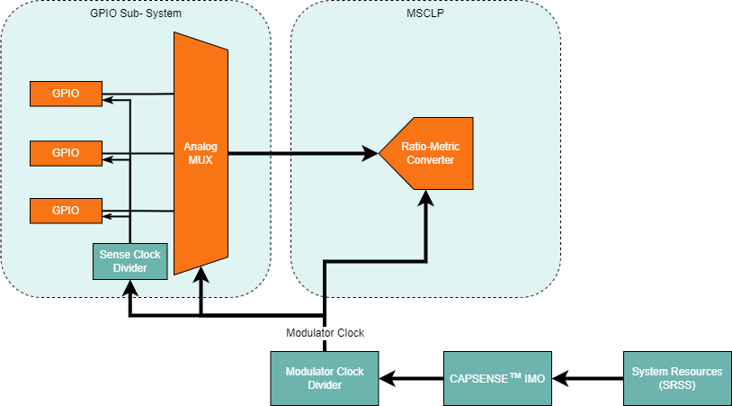
</div>

The sense clock frequency must be configured to allow for proper charging and discharging of the sensor. A slower sense clock frequency will allow for sensors with larger parasitic capacitances to charge and discharge properly. The charge/discharge cycle must be observed using an oscilloscope with active probes.


<div class="figure-images">
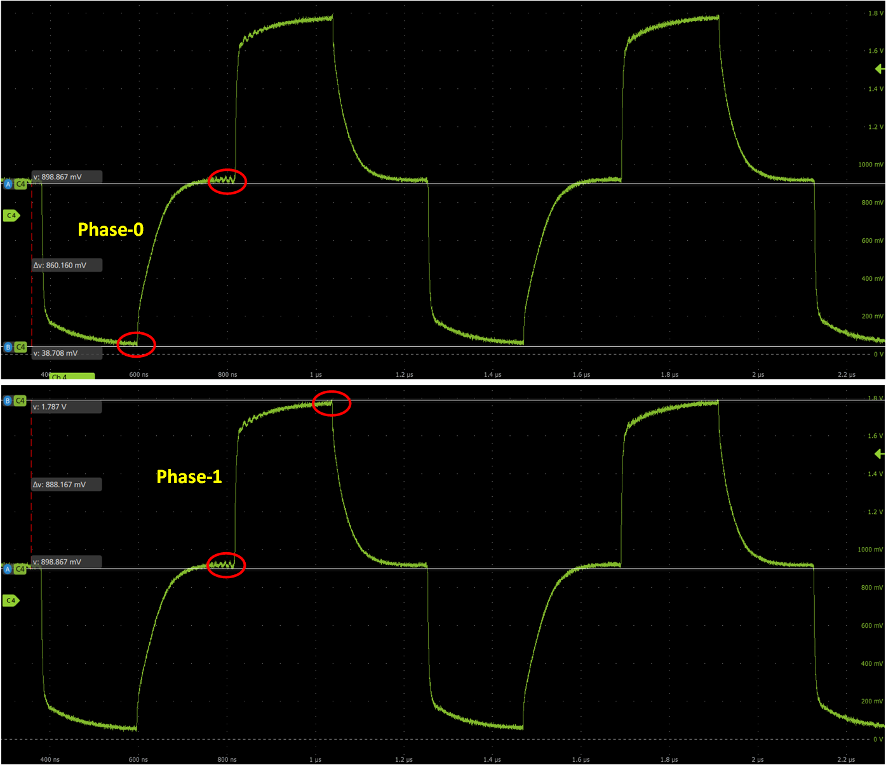
</div>


<div class="figure-images">
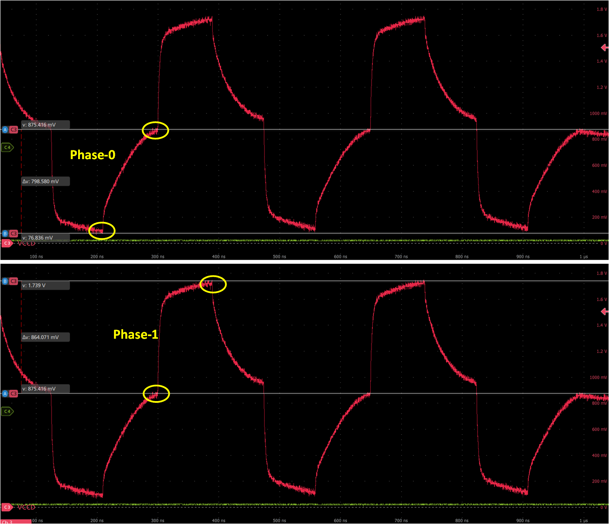
</div>

Without the proper charge/discharge cycle, the signal read by the CAPSENSE&trade; MSCLP is noisy. Follow these steps for tuning the sense clock divider.

1. Program the board and launch the **CAPSENSE&trade; Tuner**


<div class="figure-images">
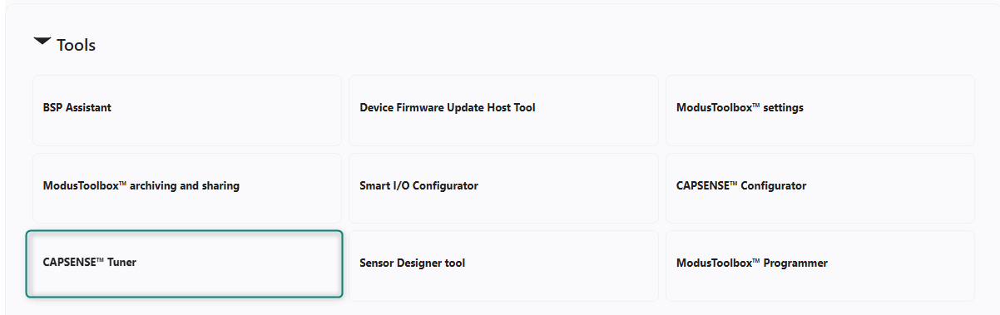
</div>

2. You may need to configure the tuner before starting the connection. This can be done by navigating to the **Tools → Tuner Communication Setup** in the top ribbon. Select your KitProg3 and choose I2C. Ensure that the Port configuration also matches


<div class="figure-images">
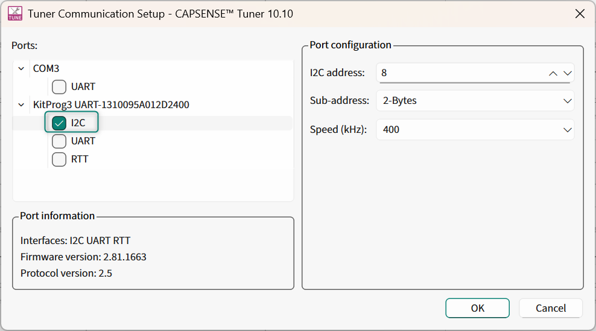
</div>

3. Connect to the target and begin streaming


<div class="figure-images">
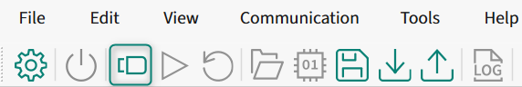
</div>


<div class="figure-images">
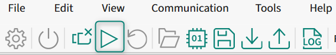
</div>

4. Enable all widgets by clicking the button in the top left corner of the **Widget Explorer**


<div class="figure-images">
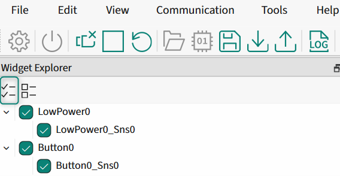
</div>

5. Observe the charging waveform of the sensor as described in [Stage 2 - Set the sense clock frequency](#_Stage_2_-_1)

6. If the charging is incomplete, increase the sense clock divider. This can be done in CAPSENSE&trade; Tuner by selecting the sensor and editing the sense clock divider parameter in the Widget/Sensor Parameters panel. The sense clock divider should be divisible by 4; this ensures that all four scan phases have equal durations

7. After editing the value, click the **Apply to Device** button and observe the waveform again. Repeat this until complete settling is observed


<div class="figure-images">
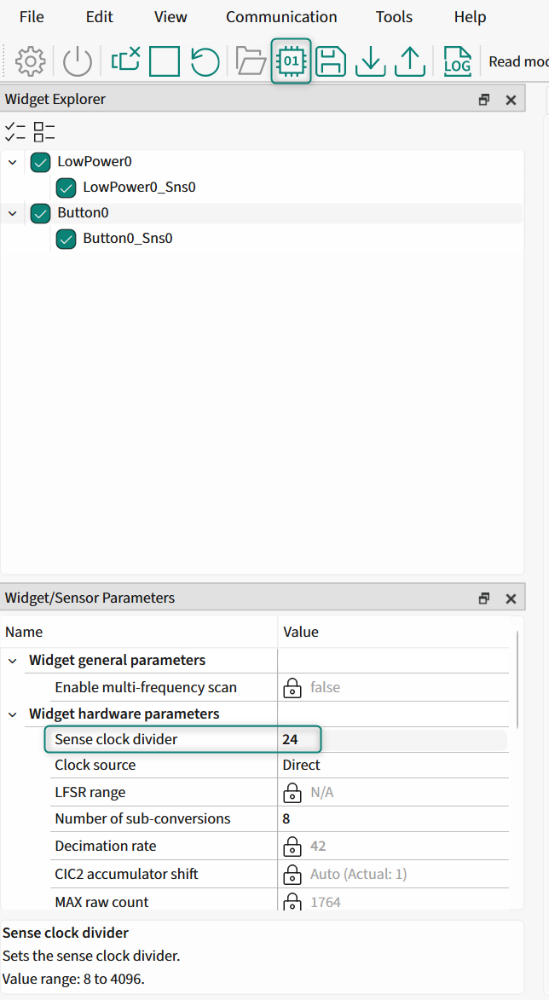
</div>

> **Note:** Using a passive probe will add parasitic capacitance of around 15 pF; therefore, it should be considered during tuning.

8. Repeat this process for all the sensors and the shield. Each sensor might require a different sense clock divider value to charge/discharge completely. But all the sensors that are in the same widget need to have the same sense clock source, sense clock divider and number of sub-conversions. Therefore, take the largest sense clock divider in a given widget and apply it to all the other sensors in the widget

9. Once the sense clock divider meets the requirements, click **Apply to Project** to save the configuration to the project


<div class="figure-images">
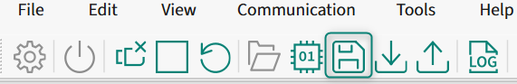
</div>

#### <span id="_Stage_3_-"></span>Stage 3 - measure sensor capacitance to set CDAC tuning mode

Generally, the CDAC tuning mode is recommended to be set to **Auto**; the appropriate tuning mode to use has some dependency on the sensor parasitic capacitance (Cp).

In order to avoid signal variation across devices in production, PSOC&trade; 4100T Plus devices have CDAC trim codes in Supervisory Flash (SFlash; read-only). This code is used to scale the Reference CDAC and Fine CDAC parameters, which compensate for variations in the CDAC and bring down the overall signal variation across units.

This trimming is only applicable when tuning CSD widgets in active and low power modes when the sensor parasitic capacitance is less than 4 pF. When using the trimming codes to scale the reference and fine CDAC values, the reference and fine CDAC modes should be set to **Manual**.

The CAPSENSE&trade; middleware provides built-in self-test (BIST) APIs to measure the capacitance of sensors configured in the application. If the BIST is run for a sensor and the result shows that a sensor's parasitic capacitance is below 4 pF, CDAC scaling should be enabled, and the CDAC values should be manually configured.

1. Measure the sensor Cp using the CAPSENSE&trade; middleware, which provides Built-In Self-Test (BIST) APIs to measure the capacitance of sensors configured in the application

2. Open CAPSENSE&trade; Configurator from the quick panel and enable the library


<div class="figure-images">
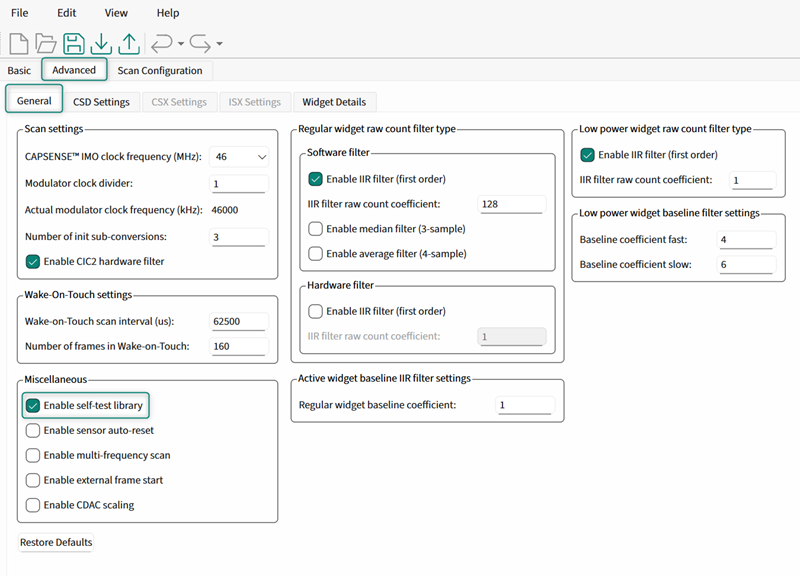
</div>

3. The middleware API used to measure the capacitance of the CSD widget, as shown below, should be placed before the main.c for loop, but after the CAPSENSE&trade; initialization

```c
/* Measure sensor capacitance of the CSD widgets */
Cy_CapSense_RunSelfTest(CY_CAPSENSE_BIST_SNS_CAP_MASK, &cy_capsense_context);
```

4. Program the device

5. Open the tuner and check the sensor capacitance (Cp) values. If the Cp value is above 4 pF, set all CDAC parameters to Auto and proceed to [Stage 4 tuning](#_Stage_4_-_1)


<div class="figure-images">
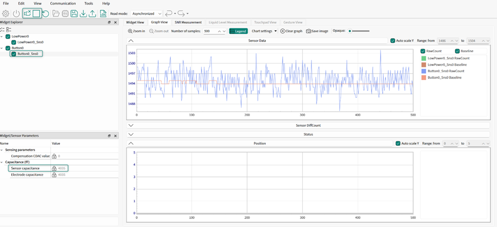
</div>

> **Note:** Remove the Self-Test API once the sensor capacitance is measured.

6. Enable CDAC scaling and set the manual CDAC values if the sensor Cp is below 4 pF

7. Close the CAPSENSE&trade; Tuner

8. Open CAPSENSE&trade; Configurator and start by setting all CDAC parameters to **Auto**


<div class="figure-images">
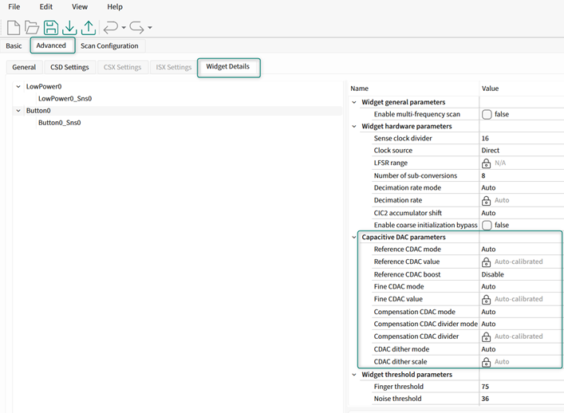
</div>

9. Program the device. Run the CAPSENSE&trade; Tuner and click the **Apply to project** button. This applies the auto-calculated CDAC values to the project configuration


<div class="figure-images">
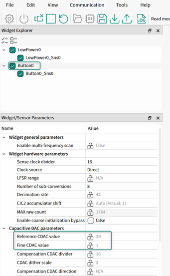
</div>

10. Close and reopen the CAPSENSE&trade; Configurator and enable CDAC scaling


<div class="figure-images">
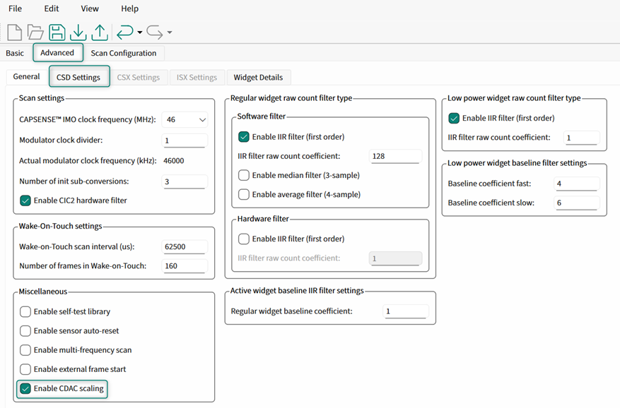
</div>

11. Set the Manual tuning mode only for Reference CDAC mode and Fine CDAC mode parameters. You can see the CDAC values observed in Figure 28 when CDAC was set to **Auto**


<div class="figure-images">
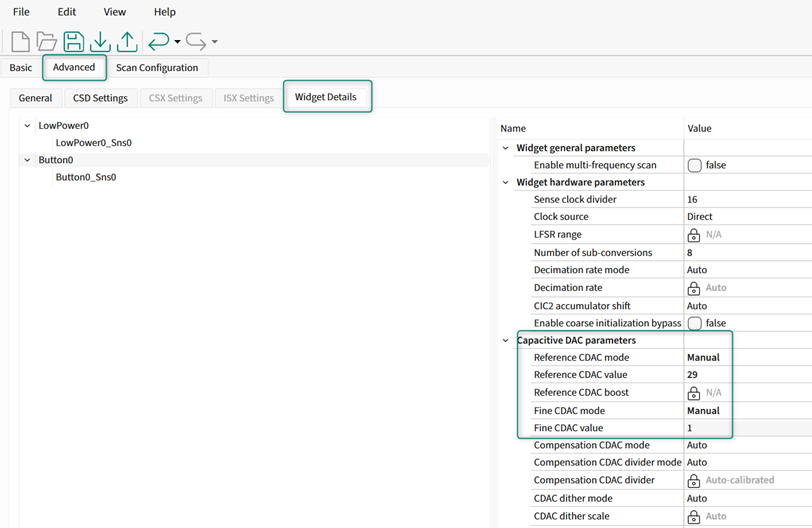
</div>

12. Flash the device with the updated CAPSENSE&trade; configuration

13. Open CAPSENSE&trade; Tuner. Now you can see the scaled parameters after applying CDAC scaling


<div class="figure-images">
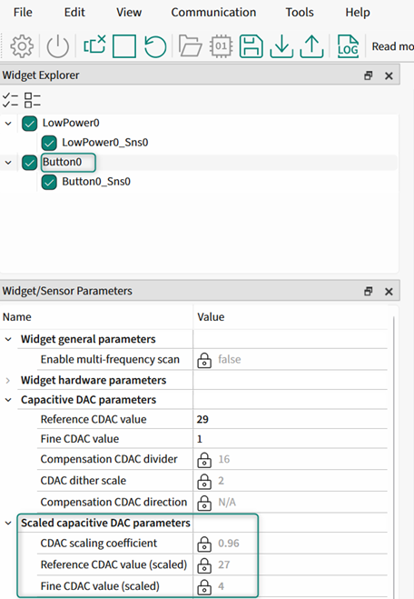
</div>

14. Use this as a base CDAC configuration and proceed with tuning

<span id="_Stage_4_-_1"></span>

#### Stage 4 - fine-tune for the required SNR, power, and refresh rate

Once the sense clock frequency is set correctly and CDAC tuning is complete, the sensor can be tuned for optimal sensitivity, timing, and power consumption requirements. Using the CAPSENSE&trade; tuner, the SNR can be measured. The number of sensor sub-conversions can be increased until the SNR requirements are met. Generally, a 5:1 SNR is the minimum required.

If the system is noisy (> 40% of signal), enable the filters. The PSOC&trade; 4100T Plus and other devices with the MSCLP block have the following raw count filters available.

| Filter | Description |
| --- | --- |
| Median | Eliminates noise spikes from motors and switching power supplies |
| Average | Eliminates periodic noise such as power supply or AC noise |
| First Order IIR | A software IIR filter that eliminates high-frequency noise. A lower coefficient results in lower noise but increases response time. The coefficient range is 1 to 255. |
| Hardware IIR | Eliminates high-frequency noise. The low coefficient means less filtering, but the response time is higher. |

The MSCLP low-power CSD button example project enables a state machine for application power modes.


<div class="figure-images">
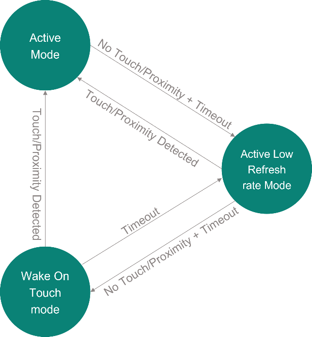
</div>

Along with filtering, the refresh rate for each application's power mode can be adjusted to increase or decrease response time and power consumption.

1. Use the CAPSENSE&trade; Tuner to measure the SNR

2. Navigate to **SNR Measurement** and click **Acquire Noise**, ensuring nothing comes within the range of the sensor


<div class="figure-images">
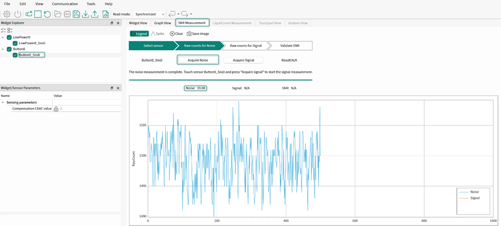
</div>

3. Once the noise is captured, generate an expected typical touch on the sensor, and then click **Acquire Signal** while generating the touch; it captures the signal


<div class="figure-images">
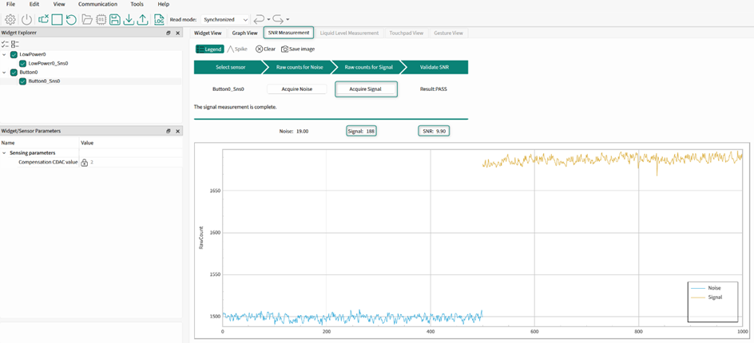
</div>

> **Note:** When tuning a low-power sensor, the raw counts are only reported to the tuner while in active or ALR application power modes. This means that while tuning the low-power sensors, data won’t appear on the graph until the device enters those modes. Also, when acquiring the signal, it is best to generate the touch, wait for a cycle of active or ALR mode, and then press the **Acquire Signal** button.

4. If the SNR is less than 5:1, increase the number of sub-conversions. Edit the number of sub-conversions (Nsub) directly in the **Widget/Sensor** parameters tab of the CAPSENSE&trade; Tuner

5. Apply changes to the device


<div class="figure-images">
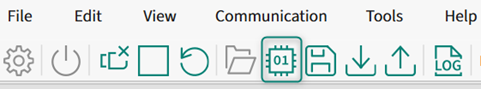
</div>

6. Repeat steps 1 to 3 until the SNR of 5:1 is met and the signal count is greater than 50

7. If the system is noisy (> 40% of signal), enable the filters described in [Stage 4 description](#_Stage_4_-_1)


<div class="figure-images">
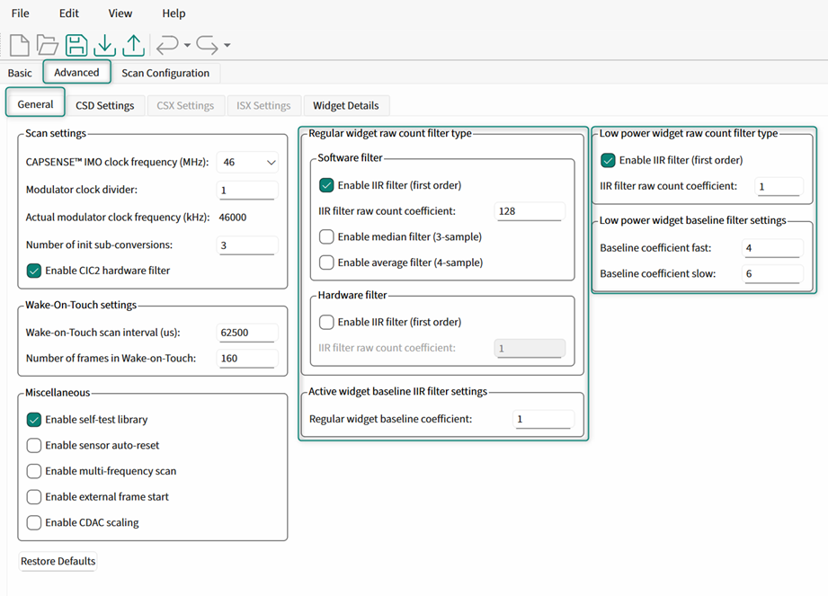
</div>

8. Click **Save** and program the device to update the filter settings

#### <span id="_Stage_5_-"></span>Stage 5 - tune the threshold parameters

Various thresholds related to the signal need to be set for each sensor. Using the CAPSENSE&trade; tuner, the sensor signal during a touch event can be observed. The recommended settings for each threshold are as follows:

| Parameter | Recommended setting |
| --- | --- |
| Finger threshold | 80% of the touch signal |
| Noise threshold | 40% of the touch threshold |
| Negative noise threshold | 40% of the touch threshold |
| Low baseline reset | 30 (by default) |
| Hysteresis | 10% of the touch signal |
| ON debounce | 3 |

1. In the CAPSENSE&trade; Tuner, switch to the **Graph View** tab and select the widget to be tuned

2. Touch the sensor widget and monitor the touch signal in the **Sensor Signal** graph


<div class="figure-images">
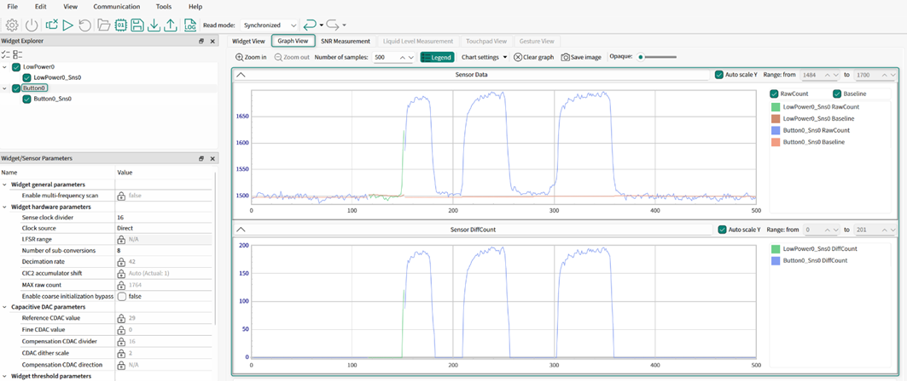
</div>

3. Using the recommendation detailed in the [Stage 5 description](#_Stage_5_-), set the thresholds and apply them using the CAPSENSE&trade; tuner


<div class="figure-images">
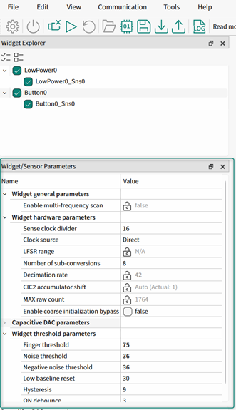
</div>

4. For the low-power sensor, set the touch threshold to the maximum (65535) to prevent a touch from waking the device from wake-on-touch mode, and then follow steps 1 to 3 for tuning the low-power sensor thresholds

### Output

After applying the configuration, test the performance by touching the button. If your sensor is tuned correctly, you will observe the touch status go from 0 to 1 in the Status panel of the Graph View tab. The status of the button is also indicated by the green LED in the kit; the green LED turns ON when the button is pressed. The red LED will blink at different rates to indicate which application power mode the device is in: 10 Hz for active mode, 2 Hz for ALR mode, and 1 Hz for WoT mode.

### Conclusion

In this exercise, you tuned a self-capacitance sensor using the CAPSENSE&trade; performance tuning method. Using this iterative method, you can tune nearly all self-capacitive sensors for optimal performance while considering the application’s performance, responsiveness, and power consumption.

<span id="capsensetm-low-power-tuning"></span>

## CAPSENSE&trade; low power tuning

### Objective

The objective of this lab is to demonstrate how to gang multiple sensors to reduce the low-power scan duration, as well as demonstrate wake-on-touch versus wake-on-approach methods of low-power HMI strategies.

### Description

When designing an HMI for a low-power application, such as a wearable device, multiple capacitive sensors are often used. The more capacitive sensors that need to be sensed, the longer the scan duration takes, causing the MSCLP block to be active for a longer period of time. In previous versions of the MSC block, a proximity electrode that typically looped around the entire touch area was needed for proximity wakeup, complicating the layout. A major benefit to using a PSOC&trade; device with the MSCLP block is the ability to gang sensors together for low-power sensing. This allows the MSCLP block to only sense a smaller subset of sensors instead of all sensors required for the HMI.


<div class="figure-images">
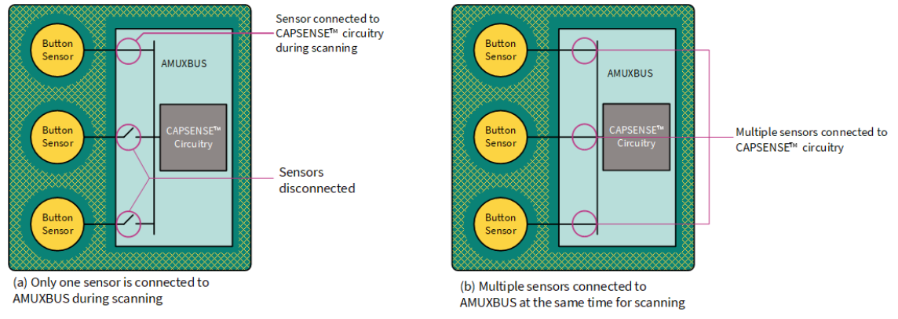
</div>

There are two main strategies for low-power sensing:

1. **Wake-on-touch (WoT)**

If the low-power sensor is tuned to detect touch, a touch event on the low-power widget will wake the device such that it begins scanning all sensors independently, which allows it to determine which button was pressed. This method will provide the lowest average power consumption as the refresh rate and scan duration in WoT mode are the lowest, and accidental proximity events with the touch area will not wake the device from WoT application power mode.

2. **Wake-on-approach**

If the low-power sensor is tuned to detect proximity, a proximity event of any button will wake the device, such that it begins scanning all sensors independently. This strategy is useful for applications where quick-tap or double-tap detection is required. Typically, the user must be able to see the touch interface for this type of user experience to be used. This strategy may cause higher average power usage as accidental proximity events near the touch interface will wake the device from the WoT application power mode.

### <span id="_Adding_the_CSX"></span>Adding the CSX button and accompanying low-power sensor

The same ModusToolbox will be used for this lab, but the CSX button will be added.

1. Launch the **CAPSENSE Configurator** from the **ModusToolbox&trade; for VS Code extension**


<div class="figure-images">

</div>

2. Add the CSX button and a LowPower from the CAPSENSE&trade; configurator - Basic tab by pressing the **+** (add) button


<div class="figure-images">
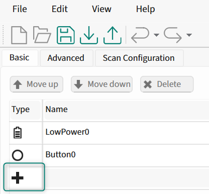
</div>

3. Select **CSX RM** as the Sensing method for the new Button1 and **CSD RM** as the Sensing Method for the new LowPower1 sensor


<div class="figure-images figure-images-stacked">
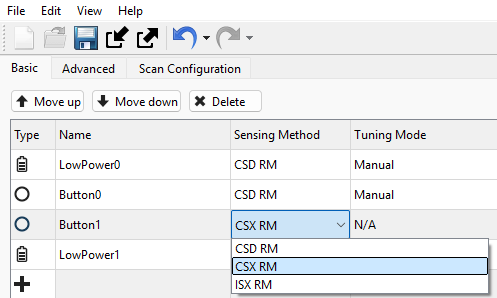
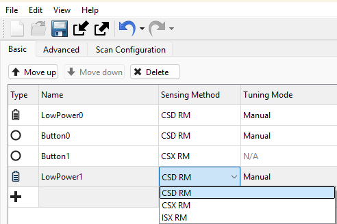
</div>

4. Navigate to the **Advanced** tab and reduce the shield count from 3 to 1. By default, when creating the CSD button example project, the CSX pins are set as shield pins

5. Navigate to the **Scan Configuration** tab and assign the RX and TX pins for the new **Button1**. Gang the RX and TX pins of **Button1** for the **LowPower1** sensor, and then set up **shield0** to use **P4.3**


<div class="figure-images">
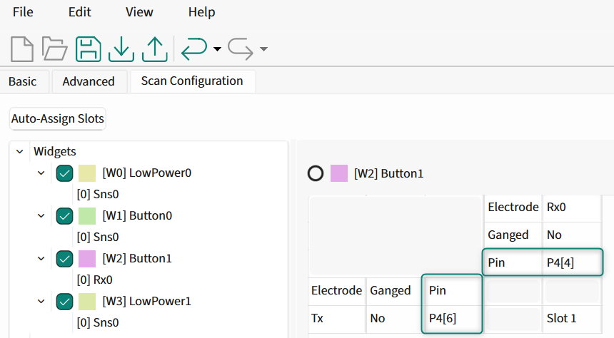
</div>


<div class="figure-images">
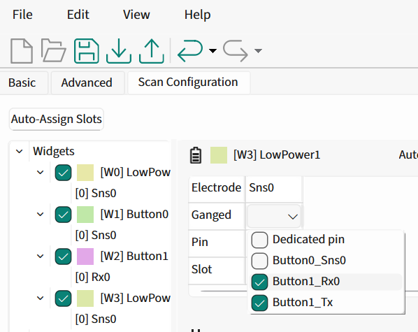
</div>


<div class="figure-images">
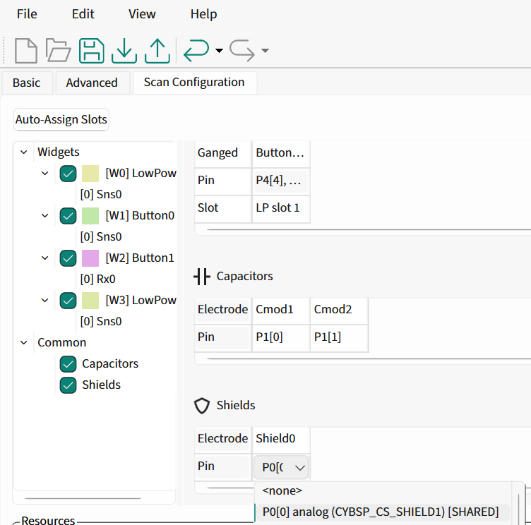
</div>

6. Update the `led_control()` function in `main.c` to activate the green LED when a touch is detected on the new button

```c
if (CAPSENSE_WIDGET_INACTIVE != Cy_CapSense_IsWidgetActive(CY_CAPSENSE_BUTTON0_WDGT_ID, &cy_capsense_context))
{
    Cy_GPIO_Write(CYBSP_USER_LED2_PORT, CYBSP_USER_LED2_NUM, CYBSP_LED_ON);
}
else if (CAPSENSE_WIDGET_INACTIVE != Cy_CapSense_IsWidgetActive(CY_CAPSENSE_BUTTON1_WDGT_ID,   &cy_capsense_context))
{
    Cy_GPIO_Write(CYBSP_USER_LED2_PORT, CYBSP_USER_LED2_NUM, CYBSP_LED_ON);
}
else
{
    Cy_GPIO_Write(CYBSP_USER_LED2_PORT, CYBSP_USER_LED2_NUM, CYBSP_LED_OFF);
}
```

7. Build and program the device and observe the green LED turning on when a touch is generated. You may notice that the sensitivity of the sensor is not set up correctly. At this point, you may go through the tuning steps from the [first lab](#_Stage_1_-), or you can apply the following settings to the CSX button


<div class="figure-images">
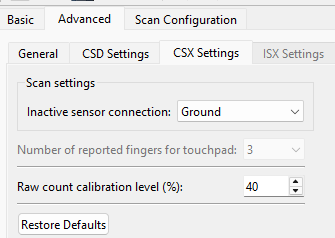
</div>


<div class="figure-images">
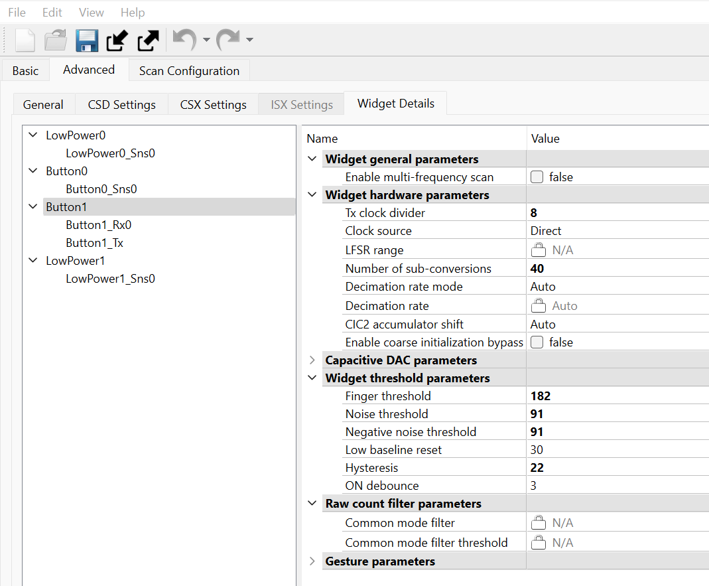
</div>

### Tuning a low-power sensor

1. Disable ALR, reduce the time for going from the **Active to WoT** mode

2. Change `ACTIVE_MODE_TIMEOUT_SEC` to `1`

```c
/* Timeout to move from ACTIVE mode to ALR mode if there is no user activity */
#define ACTIVE_MODE_TIMEOUT_SEC         (1u)
```

3. Update the **ACTIVE\_MODE** application power mode to jump from the active mode to the wake-on-touch (WOT) mode

```c
case ACTIVE_MODE:
    Cy_CapSense_ScanAllSlots(&cy_capsense_context);
    interruptStatus = Cy_SysLib_EnterCriticalSection();
    while (Cy_CapSense_IsBusy(&cy_capsense_context))
    {
        #if ENABLE_PWM_LED
        Cy_SysPm_CpuEnterSleep();
        #else
        Cy_SysPm_CpuEnterDeepSleep();
        #endif
        Cy_SysLib_ExitCriticalSection(interruptStatus);
        /* This is a place where all interrupt handlers will be executed */
        interruptStatus = Cy_SysLib_EnterCriticalSection();
    }
    Cy_SysLib_ExitCriticalSection(interruptStatus);
    #if ENABLE_RUN_TIME_MEASUREMENT
    active_processing_time=0;
    start_runtime_measurement();
    #endif
    Cy_CapSense_ProcessAllWidgets(&cy_capsense_context);
    /* Scan, process, and check the status of all Active mode sensors */
    if(Cy_CapSense_IsAnyWidgetActive(&cy_capsense_context))
    {
        capsense_state_timeout = ACTIVE_MODE_TIMEOUT;
    }
    else
    {
        capsense_state_timeout--;
        if(TIMEOUT_RESET == capsense_state_timeout)
        {
            capsense_state = WOT_MODE;
        }
    }
    #if ENABLE_RUN_TIME_MEASUREMENT
    active_processing_time=stop_runtime_measurement();
    #endif
    break;
    /* End of ACTIVE_MODE */
```

4. Update the **WOT\_MODE** application power mode state to jump to **ACTIVE\_MODE** when the timeout occurs

```c
case WOT_MODE :
    Cy_CapSense_ScanAllLpSlots(&cy_capsense_context);
    interruptStatus = Cy_SysLib_EnterCriticalSection();
    while (Cy_CapSense_IsBusy(&cy_capsense_context))
    {
        #if ENABLE_PWM_LED
        Cy_SysPm_CpuEnterSleep();
        #else
        Cy_SysPm_CpuEnterDeepSleep();
        #endif
        Cy_SysLib_ExitCriticalSection(interruptStatus);
        /* This is a place where all interrupt handlers will be executed */
        interruptStatus = Cy_SysLib_EnterCriticalSection();
    }
    Cy_SysLib_ExitCriticalSection(interruptStatus);
    if (Cy_CapSense_IsAnyLpWidgetActive(&cy_capsense_context))
    {
        capsense_state = ACTIVE_MODE;
        capsense_state_timeout = ACTIVE_MODE_TIMEOUT;
        /* Configure the MSCLP wake-up timer as per the ACTIVE mode refresh rate */
        Cy_CapSense_ConfigureMsclpTimer(ACTIVE_MODE_TIMER, &cy_capsense_context);
    }
    else
    {
        capsense_state = ACTIVE_MODE;
        capsense_state_timeout = ACTIVE_MODE_TIMEOUT;
        /* Configure the MSCLP wake-up timer as per the ACTIVE mode refresh rate */
        Cy_CapSense_ConfigureMsclpTimer(ACTIVE_MODE_TIMER, &cy_capsense_context);
    }
    break;
    /* End of "WAKE_ON_TOUCH_MODE" */
```

5. Set all touch thresholds to maximum (**65535**) to prevent a touch from being detected while tuning the
low-power sensor

6. Follow the [Performance tuning steps](#_Stage_1_-):
    * Initial parameters set (this is already complete)
    * Update the sense clock frequency
    * Fine-tune SNR, power, and refresh rate
    * Tune thresholds

7. Revert changes made in code

8. Change `ACTIVE_MODE_TIMEOUT_SEC` to `10`

```c
/* Timeout to move from ACTIVE mode to ALR mode if there is no user activity */
#define ACTIVE_MODE_TIMEOUT_SEC         (10u)
```

9. Update the **ACTIVE\_MODE** application power mode state to jump from the active mode to the ALR mode

```c
case ACTIVE_MODE:
    Cy_CapSense_ScanAllSlots(&cy_capsense_context);
    interruptStatus = Cy_SysLib_EnterCriticalSection();
    while (Cy_CapSense_IsBusy(&cy_capsense_context))
    {
        #if ENABLE_PWM_LED
        Cy_SysPm_CpuEnterSleep();
        #else
        Cy_SysPm_CpuEnterDeepSleep();
        #endif
        Cy_SysLib_ExitCriticalSection(interruptStatus);
        /* This is a place where all interrupt handlers will be executed */
        interruptStatus = Cy_SysLib_EnterCriticalSection();
    }
    Cy_SysLib_ExitCriticalSection(interruptStatus);
    #if ENABLE_RUN_TIME_MEASUREMENT
    active_processing_time=0;
    start_runtime_measurement();
    #endif
    Cy_CapSense_ProcessAllWidgets(&cy_capsense_context);
    /* Scan, process, and check the status of all Active mode sensors */
    if(Cy_CapSense_IsAnyWidgetActive(&cy_capsense_context))
    {
        capsense_state_timeout = ACTIVE_MODE_TIMEOUT;
    }
    else
    {
        capsense_state_timeout--;
        if(TIMEOUT_RESET == capsense_state_timeout)
        {
            capsense_state = ALR_MODE;
            capsense_state_timeout = ALR_MODE_TIMEOUT;
            /* Configure the MSCLP wake-up timer as per the ALR mode refresh rate */
    Cy_CapSense_ConfigureMsclpTimer(ALR_MODE_TIMER, &cy_capsense_context);
    }
    }
    #if ENABLE_RUN_TIME_MEASUREMENT
    active_processing_time=stop_runtime_measurement();
    #endif
    break;
    /* End of ACTIVE_MODE */
```

10. Update the **WOT\_MODE** application power mode state to jump to **ACTIVE\_MODE** when the timeout occurs

```c
case WOT_MODE :
    Cy_CapSense_ScanAllLpSlots(&cy_capsense_context);
    interruptStatus = Cy_SysLib_EnterCriticalSection();
    while (Cy_CapSense_IsBusy(&cy_capsense_context))
    {
        #if ENABLE_PWM_LED
        Cy_SysPm_CpuEnterSleep();
        #else
        Cy_SysPm_CpuEnterDeepSleep();
        #endif
        Cy_SysLib_ExitCriticalSection(interruptStatus);
        /* This is a place where all interrupt handlers will be executed */
        interruptStatus = Cy_SysLib_EnterCriticalSection();
    }
    Cy_SysLib_ExitCriticalSection(interruptStatus);
    if (Cy_CapSense_IsAnyLpWidgetActive(&cy_capsense_context))
    {
        capsense_state = ACTIVE_MODE;
        capsense_state_timeout = ACTIVE_MODE_TIMEOUT;
        /* Configure the MSCLP wake-up timer as per the ACTIVE mode refresh rate */
        Cy_CapSense_ConfigureMsclpTimer(ACTIVE_MODE_TIMER, &cy_capsense_context);
    }
    else
    {
        capsense_state = ALR_MODE;
        capsense_state_timeout = ALR_MODE_TIMEOUT;
        /* Configure the MSCLP wake-up timer as per the ALR mode refresh rate */
        Cy_CapSense_ConfigureMsclpTimer(ALR_MODE_TIMER, &cy_capsense_context);
    }
    break;
    /* End of "WAKE_ON_TOUCH_MODE" */
```

11. Follow the steps to measure the current and fill out the table in the [Measurements](#_Measurements_2) section for the “Two Low Power Sensors” configuration

### Set up a single low-power sensor for wake on touch

1. Open the CAPSENSE&trade; Configurator and remove the **LowPower1** sensor that was added in [section 4.3](#_Adding_the_CSX) by selecting the sensor and pressing the **Delete** button


<div class="figure-images">
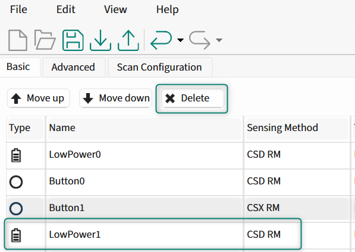
</div>

2. Navigate to the **Scan Configuration** tab, and then in the **LowPower0** configuration, select the Button0 and Button1 pins in the **Ganged** row to enable ganging of all electrodes for the low-power sensor


<div class="figure-images">
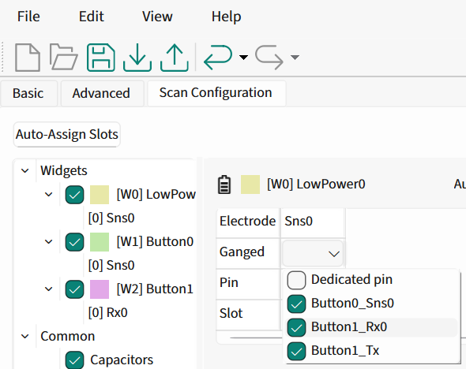
</div>

3. See the section Tuning a low-power sensor, to follow the steps to tune the low-power sensor

4. Follow the steps to measure the current and fill out the table in the [Measurements](#_Measurements_2) section for the “One Low Power Sensor” configuration

### Adjust for wake on approach

In some applications, it is critical to capture the user’s first touch. This is typical for battery-powered applications where the user can see the touch surface. In these applications, the user experience often requires that the device detect quick-tap or, in some cases, double-tap input on the CAPSENSE&trade; button. To accomplish this, you can increase the refresh rate of the low-power sensor or reduce the touch threshold so that a proximity event triggers the touch event. Increasing the refresh rate increases the average current consumption. Tuning the low-power sensor for proximity may also cause a higher average current if the user accidentally interacts with the touch surface.

1. Tune the sensor for proximity by increasing the sensitivity and reducing the touch threshold to 60% of the signal determined from the SNR step while going through the [performance tuning](#_Stage_1_-)


<div class="figure-images">
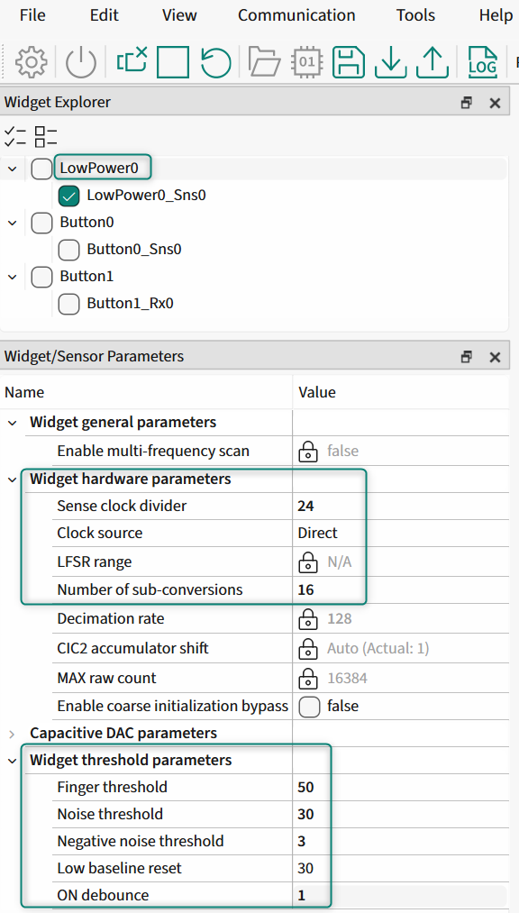
</div>

2. Follow the steps to measure the current and fill out the table in the [Measurements](#_Measurements_2) section for the “One Low Power Sensor; Wake on Approach” configuration

### <span id="_Measurements_2"></span>Measurements

1. Disable the **Debug** port in the **Device Configurator**


<div class="figure-images">
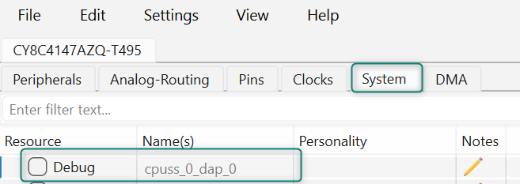
</div>

2. Set `ENABLE_PWM_LED` to `0`

```c
/*Enable PWM controlled LEDs*/
#define ENABLE_PWM_LED                  (0u)
```

3. Set `ENABLE_TUNER` to `0`

```c
/* Enable this, if Tuner needs to be enabled */
#define ENABLE_TUNER                    (0u)
```

4. Re-program the device, and then wait until the device is in its Wake-on-touch application power mode. Measure the current using the jumper (J2) and write down the measured current in the following table

| Configuration | Expected current | Measured current |
| --- | --- | --- |
| Two Low-power sensors | 5 µA | ‒ |
| One Low-power sensor | 4.3 µA | ‒ |
| One Low-power sensor; Wake on approach | 4.5 µA | ‒ |

### Output

After applying the configuration, test the performance by touching the buttons. If your sensors are tuned correctly, you will observe the touch status go from 0 to 1 in the Status panel of the Graph View tab. The status of the buttons is also indicated by the green LED in the kit. If the wake-on-touch strategy is used, a clear press is required for the green LED to activate. If the wake-on-approach strategy is used, quick and double taps should activate the green LED.

### Conclusion

In this exercise, you added a new sensor to a design, tuned a low-power sensor, and implemented different low-power sensing strategies. You also learned the steps required to achieve the lowest power consumption while maintaining the required sensing for a given HMI.

## References

* Infineon Technologies AG: AN85951: PSOC&trade; 4 and PSOC&trade; 6 MCU CAPSENSE&trade; design guide; [Available online](https://www.infineon.com/dgdl/Infineon-AN85951_PSoC_4_and_PSoC_6_MCU_CapSense_Design_Guide-ApplicationNotes-v28_00-EN.pdf?fileId=8ac78c8c7cdc391c017d0723535d4661)


## Revision history

<div class="no-center-table" markdown="1">

| Document revision | Date | Description of changes |
| :--- | :--- | :--- |
| \*\* | 2025-12-04 | Initial release |
| \*A | 2026-05-19 | Updated to the latest Empower template. |

</div>

## Disclaimer

All referenced product or service names and trademarks are the property of their respective owners.

The Bluetooth&reg; word mark and logos are registered trademarks owned by Bluetooth SIG, Inc., and any use of such marks by Infineon is under license.

PSOC&trade;, formerly known as PSoC&trade;, is a trademark of Infineon Technologies. Any references to PSoC&trade; in this document or others shall be deemed to refer to PSOC&trade;.

---------------------------------------------------------

© Cypress Semiconductor Corporation, 2023-2026. This document is the property of Cypress Semiconductor Corporation, an Infineon Technologies company, and its affiliates ("Cypress").  This document, including any software or firmware included or referenced in this document ("Software"), is owned by Cypress under the intellectual property laws and treaties of the United States and other countries worldwide.  Cypress reserves all rights under such laws and treaties and does not, except as specifically stated in this paragraph, grant any license under its patents, copyrights, trademarks, or other intellectual property rights.  If the Software is not accompanied by a license agreement and you do not otherwise have a written agreement with Cypress governing the use of the Software, then Cypress hereby grants you a personal, non-exclusive, nontransferable license (without the right to sublicense) (1) under its copyright rights in the Software (a) for Software provided in source code form, to modify and reproduce the Software solely for use with Cypress hardware products, only internally within your organization, and (b) to distribute the Software in binary code form externally to end users (either directly or indirectly through resellers and distributors), solely for use on Cypress hardware product units, and (2) under those claims of Cypress's patents that are infringed by the Software (as provided by Cypress, unmodified) to make, use, distribute, and import the Software solely for use with Cypress hardware products.  Any other use, reproduction, modification, translation, or compilation of the Software is prohibited.
<br>
TO THE EXTENT PERMITTED BY APPLICABLE LAW, CYPRESS MAKES NO WARRANTY OF ANY KIND, EXPRESS OR IMPLIED, WITH REGARD TO THIS DOCUMENT OR ANY SOFTWARE OR ACCOMPANYING HARDWARE, INCLUDING, BUT NOT LIMITED TO, THE IMPLIED WARRANTIES OF MERCHANTABILITY AND FITNESS FOR A PARTICULAR PURPOSE.  No computing device can be absolutely secure.  Therefore, despite security measures implemented in Cypress hardware or software products, Cypress shall have no liability arising out of any security breach, such as unauthorized access to or use of a Cypress product. CYPRESS DOES NOT REPRESENT, WARRANT, OR GUARANTEE THAT CYPRESS PRODUCTS, OR SYSTEMS CREATED USING CYPRESS PRODUCTS, WILL BE FREE FROM CORRUPTION, ATTACK, VIRUSES, INTERFERENCE, HACKING, DATA LOSS OR THEFT, OR OTHER SECURITY INTRUSION (collectively, "Security Breach").  Cypress disclaims any liability relating to any Security Breach, and you shall and hereby do release Cypress from any claim, damage, or other liability arising from any Security Breach.  In addition, the products described in these materials may contain design defects or errors known as errata which may cause the product to deviate from published specifications. To the extent permitted by applicable law, Cypress reserves the right to make changes to this document without further notice. Cypress does not assume any liability arising out of the application or use of any product or circuit described in this document. Any information provided in this document, including any sample design information or programming code, is provided only for reference purposes.  It is the responsibility of the user of this document to properly design, program, and test the functionality and safety of any application made of this information and any resulting product.  "High-Risk Device" means any device or system whose failure could cause personal injury, death, or property damage.  Examples of High-Risk Devices are weapons, nuclear installations, surgical implants, and other medical devices.  "Critical Component" means any component of a High-Risk Device whose failure to perform can be reasonably expected to cause, directly or indirectly, the failure of the High-Risk Device, or to affect its safety or effectiveness.  Cypress is not liable, in whole or in part, and you shall and hereby do release Cypress from any claim, damage, or other liability arising from any use of a Cypress product as a Critical Component in a High-Risk Device. You shall indemnify and hold Cypress, including its affiliates, and its directors, officers, employees, agents, distributors, and assigns harmless from and against all claims, costs, damages, and expenses, arising out of any claim, including claims for product liability, personal injury or death, or property damage arising from any use of a Cypress product as a Critical Component in a High-Risk Device. Cypress products are not intended or authorized for use as a Critical Component in any High-Risk Device except to the limited extent that (i) Cypress's published data sheet for the product explicitly states Cypress has qualified the product for use in a specific High-Risk Device, or (ii) Cypress has given you advance written authorization to use the product as a Critical Component in the specific High-Risk Device and you have signed a separate indemnification agreement.
<br>
Cypress, the Cypress logo, and combinations thereof, ModusToolbox, PSoC, CAPSENSE, EZ-USB, F-RAM, and TRAVEO are trademarks or registered trademarks of Cypress or a subsidiary of Cypress in the United States or in other countries. For a more complete list of Cypress trademarks, visit www.infineon.com. Other names and brands may be claimed as property of their respective owners.